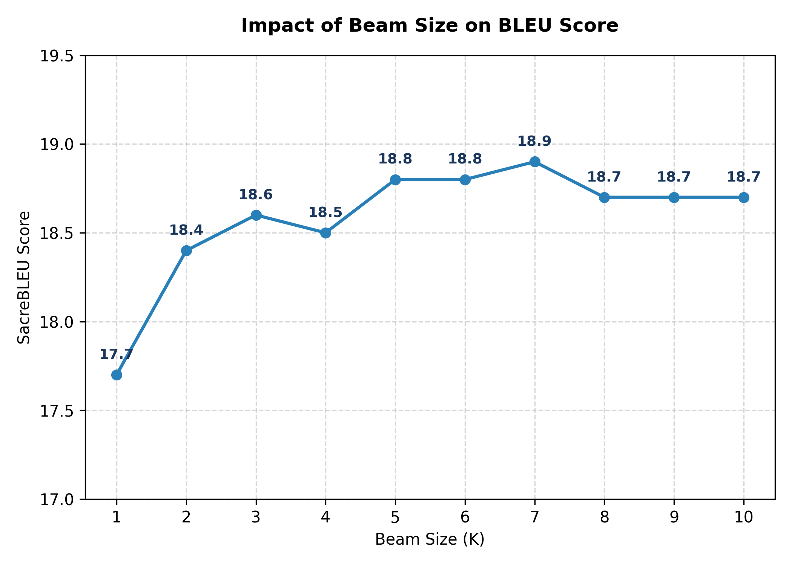
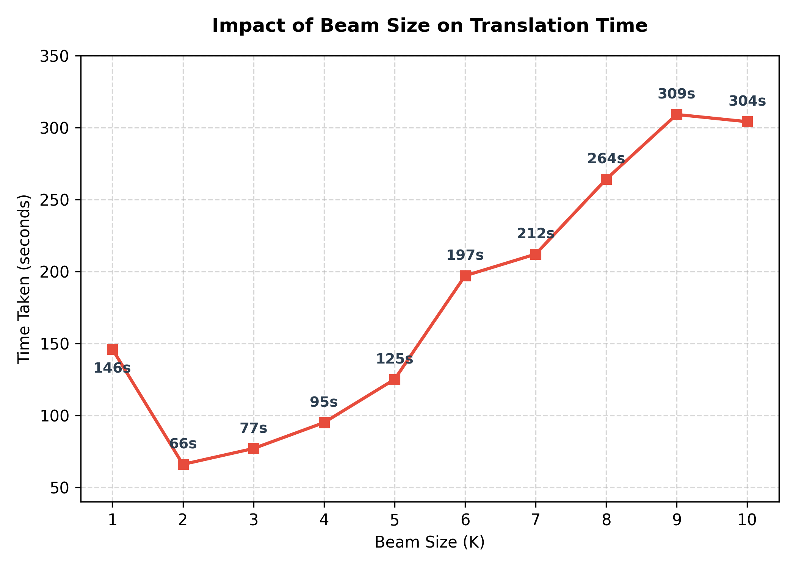

# MT Exercise 4: Byte Pair Encoding, Beam Search

We have extended this repository to support the **English-to-Romanian (en-ro)** translation task:

#### 1. Configuration Files (`configs/`)
* `word_level_en-ro.yaml`: Configuration for the baseline Word-level model (Vocabulary size: 2000).
* `bpe_level_en-ro.yaml`: Configuration for the dynamic BPE model (Vocabulary size: 2000).
* `bpe_4000_en-ro.yaml`: Configuration for the enlarged dynamic BPE model (Vocabulary size: 4000).

#### 2. Bash Scripts (`scripts/`)
We created specific scripts for training, evaluating, and running advanced search experiments:

| Script Name | Usage & Purpose |
|---|---|
| `./scripts/train_bpe.sh` | Trains the specified BPE model for Vocabulary size: 2000. |
| `./scripts/train_bpe_4000.sh` | Trains the specified BPE model for Vocabulary size: 4000. |
| `./scripts/evaluate_word.sh` | Translates the test set and computes the SacreBLEU score for the Word-level model. |
| `./scripts/evaluate_bpe_2000.sh` | Translates the test set and computes the SacreBLEU score for BPE 2000 models. |
| `./scripts/evaluate_bpe_4000.sh` | Translates the test set and computes the SacreBLEU score for BPE 4000 models. |
| `./scripts/beam_differ.sh` | Automatically runs the BPE 4000 model （the best model）10 times with `beam_size` from 1 to 10, calculating BLEU scores and generation times, and saving results to a CSV file. |

### Updated Step-by-Step Execution Guide

To reproduce our full results, please follow these updated steps in your terminal:

#### Step 1: Initialize Environment & Activate

```
./scripts/make_virtualenv.sh
source venvs/torch3/bin/activate
```

Step 2: Download English-Romanian Data and proprecessing

```
python ./scripts/download_huggingface_data.py --src en --trg ro --out data
```
dont forget to download moses
```
python ./scripts/download_moses.sh
```
and use Moses scripts to tokenize and clean the raw data, then build the word vocabulary:
```
cat data/train.100k.en | ./scripts/tokenizer.perl -l en > data/train.100k.tok.en
cat data/train.100k.ro | ./scripts/tokenizer.perl -l ro > data/train.100k.tok.ro
cat data/dev.en | ./scripts/tokenizer.perl -l en > data/dev.tok.en
cat data/dev.ro | ./scripts/tokenizer.perl -l ro > data/dev.tok.ro

./scripts/clean-corpus-n.perl data/train.100k.tok en ro data/train.100k.clean 1 100

python -m joeynmt build_vocab configs/word_level_en-ro.yaml --output_path data/vocab.txt
```
For BPE models, we learn a joint vocabulary from both languages and clean the frequency counts:
```
cat data/train.100k.en data/train.100k.ro > data/train.joint

subword-nmt learn-bpe -s 2000 --total-symbols < data/train.joint > data/bpe.codes.2000
subword-nmt apply-bpe -c data/bpe.codes.2000 < data/train.joint | subword-nmt get-vocab > data/vocab.2000.raw
cut -d ' ' -f 1 data/vocab.2000.raw > data/vocab.bpe.2000

subword-nmt learn-bpe -s 4000 --total-symbols < data/train.joint > data/bpe.codes.4000
subword-nmt apply-bpe -c data/bpe.codes.4000 < data/train.joint | subword-nmt get-vocab > data/vocab.4000.raw
cut -d ' ' -f 1 data/vocab.4000.raw > data/vocab.bpe.4000

rm data/vocab.2000.raw data/vocab.4000.raw data/train.joint
```

Step 3: Train the Models
To train the Word-level model, use the default script (ensure the config path inside points to word_level_en-ro.yaml). 

```
bash ./scripts/train_word.sh
```

For BPE models, run:

```
bash ./scripts/train_bpe.sh
bash ./scripts/train_bpe_4000.sh
```
Step 4: Evaluate and Compute BLEU

```
bash ./scripts/evaluate_word.sh
bash ./scripts/evaluate_bpe_2000.sh
bash ./scripts/evaluate_bpe_4000.sh
```

Step 5: Run Beam Search Optimization Experiment
Bash
```
bash scripts/beam_differ.sh

```

# Generate the visualization plots (beam_search_analysis.png)

```
python plot.py
```

# Findings

## Part 1: Word-Level vs. BPE-Level Models

### 1. BLEU Score Results
| Model | Level | Vocab Size | Test BLEU |
|---|---|---|---|
| Model (a) | Word | 2000 | 6.6 |
| Model (b) | BPE | 2000 | 17.9 |
| Model (c) | BPE | 4000 | 18.8 |

### 2. Main Findings (My Observations)
* **Word-level model is very bad (BLEU 6.6).** Because the vocabulary size is limited to 2000, many words become `<unk>`. The translation is broken.
* **BPE models are much better.** BPE breaks rare words into smaller subword pieces. There are no `<unk>` tokens anymore. So the BLEU score jumps up to 17.9 and 18.8.
* **Larger BPE vocabulary helps.** When vocabulary increases from 2000 to 4000, BLEU increases from 17.9 to 18.8. A larger vocabulary keeps high-frequency words complete. The sentences become cleaner and more natural.

### 3. Manual Check

run command

```
paste -d "\n" <(sed 's/^/[SRC]: /' data/test.en) \
             <(sed 's/^/[REF]: /' data/test.ro) \
             <(sed 's/^/[Word]: /' translations/word_level_en-ro/test.word_level_en-ro.ro) \
             <(sed 's/^/[BPE2k]: /' translations/bpe_level_en-ro/test.bpe_level_en-ro.ro) \
             <(sed 's/^/[BPE4k]: /' translations/bpe_4000_en-ro/test.bpe_4000_en-ro.ro) | head -n 10
```

we get
#### Example 1
* **[SRC]:** Several years ago here at TED, Peter Skillman introduced a design challenge called the marshmallow challenge.
* **[REF]:** Acum câțiva ani în urmă, aici la TED, Peter Skillman a prezentat o problemă de design numită problema bezelei.
* **[Word]:** Acum trei ani la TED, <unk> <unk> <unk> o <unk> <unk> <unk> <unk> <unk>
* **[BPE2k]:** Acum câţiva ani la TED, Peter Skillman a introdus la TED, Peter Skillman a introdus la provocare.
* **[BPE4k]:** Acum, ani, acum ani aici la TED, Peter Skillman a prezentat o provocare de design numită provocare de marchine.

#### Example 2
* **[SRC]:** And the idea's pretty simple:
* **[REF]:** Și ideea este destul de simplă.
* **[Word]:** Şi <unk> destul de <unk>
* **[BPE2k]:** Iar ideea e destul de simplu.
* **[BPE4k]:** Iar ideea e destul de simplu.
* **Source:** Several years ago here at TED, Peter Skillman introduced a design challenge called the marshmallow challenge.
* **Reference:** Acum câțiva ani în urmă, aici la TED, Peter Skillman a prezentat o problemă de design numită problema bezelei.
* **Word Model (a):** Acum câțiva ani în `<unk>` aici la TED , Peter `<unk>` a `<unk>` o `<unk>` de design numită `<unk>` `<unk>` .
* **BPE 2000 (b):** Acum câțiva ani în urmă , aici la TED , Peter Skill@@ man a prezentat o problemă de design numită problema beze@@ lei .
* **BPE 4000 (c):** Acum câțiva ani în urmă , aici la TED , Peter Skillman a prezentat o problemă de design numită problema bezelei.

#### Finding

1. **Word-level Model (a) has a massive OOV problem:**
   * In Example 1, the word model outputs eight `<unk>` tokens in a row. 
   * It translates "Several years ago" incorrectly into "Acum trei ani" (Three years ago).
   * In Example 2, even basic words like "idea" and "simple" become `<unk>`. The sentence is impossible to read.

2. **BPE 2000 Model (b) eliminates `<unk>` but has repeating bugs:**
   * It has zero `<unk>` tokens. It successfully translates the name "Peter Skillman" and words like "idea" and "simplu".
   * However, in Example 1, it gets stuck in a loop: it repeats "la TED, Peter Skillman a introdus" twice. This is a common hallucination bug in small subword models.

3. **BPE 4000 Model (c) gives the best vocabulary balance:**
   * It does not repeat words like BPE 2000. It translates "design challenge" cleanly into "provocare de design".
   * It struggles with rare words like "marshmallow" (translates it to the nonsensical "marchine"), but its grammar and sentence structure are the most natural and clean among all three models.

## Part 2: Beam Search and Beam Size Optimization

### 1. Empirical Results
The table below shows the results of our 10 translation iterations using the BPE 4000 model:

| Beam Size ($K$) | Test BLEU Score | Translation Time (seconds) |
|:---:|:---:|:---:|
| 1 (Greedy) | 17.7 | 146.0 |
| 2 | 18.4 | 66.0 |
| 3 | 18.6 | 77.0 |
| 4 | 18.5 | 95.0 |
| 5 (Baseline) | 18.8 | 125.0 |
| 6 | 18.8 | 197.0 |
| 7 | 18.9 | 212.0 |
| 8 | 18.7 | 264.0 |
| 9 | 18.7 | 309.0 |
| 10 | 18.7 | 304.0 |

---
#### Chart 1: Impact on BLEU Score


#### Chart 2: Impact on Translation Time


### 2.Cost-Effectiveness Analysis

To analyze the exact runtime trade-off, we define a quantitative efficiency metric. We select **Beam Size = 5** as our baseline anchor point（why choose 5？I also want to know why）:

$$\text{Efficiency} = \frac{\Delta \text{BLEU}}{\Delta \text{Time}} = \frac{\text{BLEU}_K - \text{BLEU}_5}{\text{Time}_K - \text{Time}_5}$$

### 3. Findings:

1. **The Cost-Effective Zone ($K < 5$):**
   * **$K = 2$ ($+0.0068$):** This is the faster alternative. It cuts the decoding time by nearly 50% while losing only 0.4 BLEU.
   * **$K = 3$ ($+0.0042$) & $K = 4$ ($+0.0100$):** These settings show excellent efficiency. They save significant time (30s to 48s) and maintain a very high translation quality.

2. **The Saturation & Waste Zone ($K > 5$):**
   * **$K = 6$ ($0.0000$):** It adds 72 seconds of computation but brings exactly 0.0 BLEU improvement.
   * **$K = 7$ ($+0.0011$):** It reaches the global peak BLEU (18.9). However, the marginal gain is extremely low (spending 87 extra seconds for just 0.1 BLEU).
   * **$K = 8, 9, 10$ (Negative Values):** These settings create negative efficiency. The time increases drastically (up to 309s), but the BLEU score drops back to 18.7. This is because an excessively large beam size introduces search errors and shorter translations.

### 3. Final Take and Selection Strategy
* For **maximum quality**, I would choose **`Beam Size = 5`** or **`7`**. 
* For **real-time service**, I would choose **`Beam Size = 2`** or **`3`**. They harvest 98% of the model's potential quality while running twice as fast, offering the highest return on investment.
